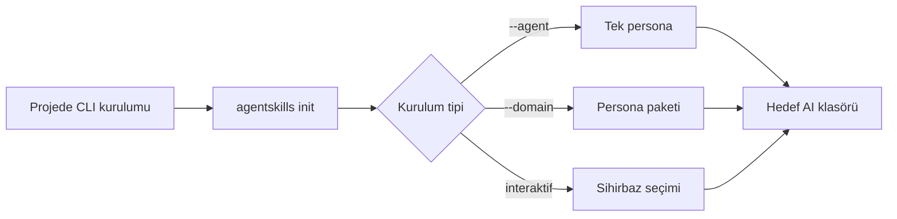
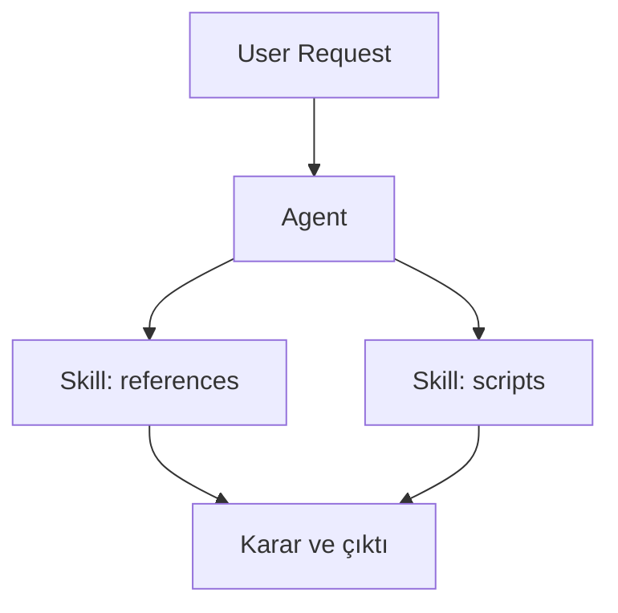
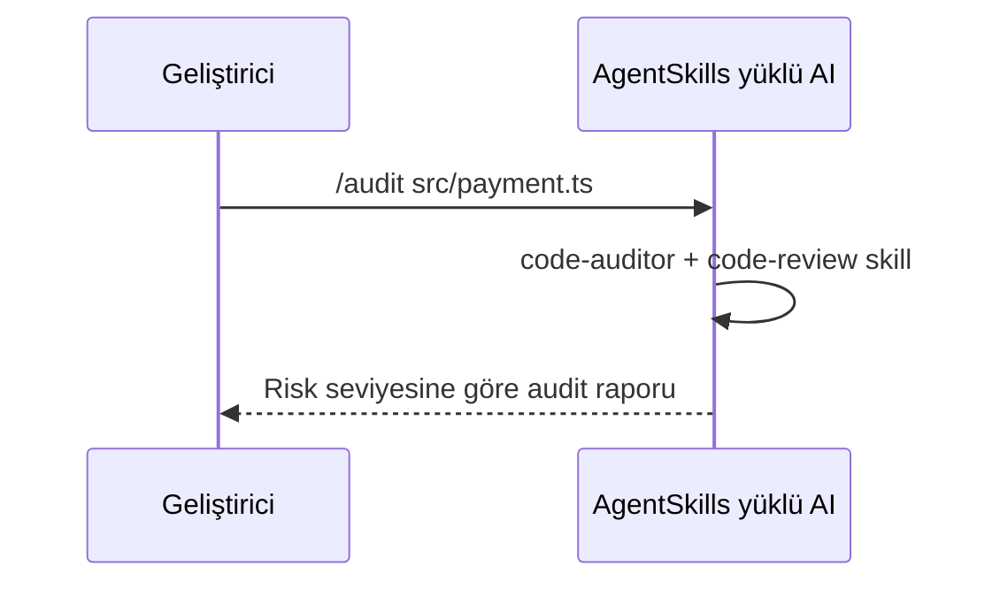

# AgentSkills V2


AgentSkills; Cursor, Copilot, Claude, Gemini ve diğer AI coding asistanları için çok ajanlı (`agents`) ve yetenek tabanlı (`skills`) bir çalışma katmanı sağlar.  
Bu yapı ile asistanı tek bir genel bot yerine, görev bazlı uzman rollere dönüştürür.

## İçindekiler
- [Hızlı Başlangıç (2 Dakika)](#hızlı-başlangıç-2-dakika)
- [Kurulum Sonrası Kullanım (Direkt Prompt)](#kurulum-sonrası-kullanım-direkt-prompt)
- [Temel Kavramlar](#temel-kavramlar)
- [CLI Komut Rehberi](#cli-komut-rehberi)
- [AI Platform Matrisi](#ai-platform-matrisi)
- [Domain Paketleri](#domain-paketleri)
- [Agent Kataloğu (8/8)](#agent-kataloğu-88)
- [Skill Kataloğu (8/8)](#skill-kataloğu-88)
- [Workflow Rehberi (5/5)](#workflow-rehberi-55)
- [Kurulum Sonrası Dosya Yapısı](#kurulum-sonrası-dosya-yapısı)
- [Sık Sorunlar ve Çözüm](#sık-sorunlar-ve-çözüm)
- [Katkı](#katkı)

## Hızlı Başlangıç (2 Dakika)
```bash
# 1) CLI kur
npm install -g @cagriemiracikkapi-projects/agentskills-cli

# 2) Tek bir agent kur
agentskills init --agent senior-backend --ai cursor

# 3) Veya bir domain paketi kur
agentskills init --domain game --ai copilot

# 4) Veya interaktif sihirbaz
agentskills init
```

Notlar:
- `--agent` ve `--domain` aynı komutta birlikte kullanılmaz.
- `--ai all` kısa yolu sadece `cursor`, `claude`, `copilot` için kurulum yapar.

## Kurulum Sonrası Kullanım (Direkt Prompt)

Kısa cevap: Evet, kurulumdan sonra çoğu durumda direkt prompt yazmanız yeterlidir.

Doğru akış:
1. Proje kökünde AgentSkills kurulum komutunu çalıştırın.
2. AI asistanının okuduğu hedef klasörün oluştuğunu doğrulayın (`.cursor/rules`, `.claude`, `.github`).
3. IDE/AI chat panelini yeniden başlatın veya yeni sohbet açın.
4. İsteğinizi direkt yazın.

Harita mühendisliği için modern web sitesi örneği:

```bash
# Tasarım + frontend odaklı domain kurulumu
agentskills init --domain frontend --ai cursor
```

Sonra AI chat'e direkt yazabilirsiniz:

```text
Harita mühendisligi firmasi icin modern, mobil uyumlu bir websitesi tasarimi olustur.
Ana sayfa, hizmetler, projeler, iletisim ve teklif formu bolumleri olsun.
Renk paleti kurumsal ve guven veren tonda olsun.
```

Daha güçlü sonuç için önerilen prompt:

```text
Harita muhendisligi firmasi icin modern bir web sitesi tasarla.
Tech stack: Next.js + Tailwind.
Sayfalar: Ana Sayfa, Hizmetler, Projeler, Hakkimizda, Iletisim.
Cikti: once bilgi mimarisi, sonra wireframe mantigi, sonra component listesi, sonra ornek kod.
```

Ne zaman tekrar `init` gerekir:
- Farklı bir AI platformuna geçiyorsanız (`cursor` -> `claude` gibi).
- Farklı domain/agent seti yüklemek istiyorsanız.
- Global rules, workflows veya agent içeriklerini güncel sürümden yeniden çekmek istiyorsanız.

## Kurulum Kanalları

### 1) NPM (önerilen)
```bash
npm install -g @cagriemiracikkapi-projects/agentskills-cli
```

### 2) GitHub fallback (NPM yoksa)
```bash
npm install -g git+https://github.com/cagriemiracikkapi-projects/AgentSkills.git#main:cli
```

### 3) Local fallback (en garanti yol)
```bash
git clone https://github.com/cagriemiracikkapi-projects/AgentSkills.git
cd AgentSkills/cli
npm install
npm link
```



## Temel Kavramlar
- `Agent`: Uzman rol (ör: `senior-backend`, `qa-automation`).
- `Skill`: Agent’in kullandığı yetenek seti (ör: `api-design`, `qa-testing`).
- `Workflow`: Görev tetikleyici kısayollar (ör: `/audit`, `/test`).
- `Domain`: Birden fazla agent’i birlikte kuran paket (ör: `web`, `game`).

## CLI Komut Rehberi

| Amaç | Komut | Açıklama |
|---|---|---|
| Yardım | `agentskills --help` | Ana komut ve alt komutları gösterir |
| Agent kurulumu | `agentskills init --agent senior-frontend --ai cursor` | Tek uzman rol kurar |
| Domain kurulumu | `agentskills init --domain backend --ai codex` | Domain’e bağlı tüm agent’leri kurar |
| Interaktif kurulum | `agentskills init` | Agent/domain ve AI seçimini sorar |
| Yerelden test | `agentskills init --agent code-auditor --ai cursor --local` | `.agents/` içeriğinden kurar |
| Kaynak repo override | `agentskills init --agent senior-backend --ai cursor --source-repo cagriemiracikkapi-projects/AgentSkills --source-branch main` | Remote içerik kaynağını manuel belirler |
| Dry-run | `agentskills init --domain frontend --ai gemini --dry-run` | Dosya yazmadan üretim/temizlik özetini gösterir |
| Compat kapatma | `agentskills init --domain frontend --ai codex --no-compat` | Compat exportları kapatır (default açıktır) |

Parametreler:
- `--agent <name>`: Tek persona.
- `--domain <name>`: Çoklu persona paketi.
- `--ai <platform>`: Hedef platform.
- `--local`: Remote yerine yerel `.agents` kaynağı.
- `--source-repo <owner/repo>`: Remote `.agents` kaynağını override eder.
- `--source-branch <branch>`: Remote kaynak branch’ini override eder.
- `--no-compat`: Compatibility exportlarını kapatır (`.agents/workflows`, ek command pathleri).
- `--no-cleanup-legacy`: AgentSkills tarafından yönetilen legacy dosyaları temizlemeyi kapatır.
- `--dry-run`: Yazma/silme yapmadan planlanan değişiklikleri raporlar.

Env alternatifleri:
```bash
# Windows (PowerShell)
$env:AGENTSKILLS_REPO="cagriemiracikkapi-projects/AgentSkills"
$env:AGENTSKILLS_BRANCH="main"
```

## AI Platform Matrisi

| `--ai` | Canonical klasörleme | Compat export (default açık) |
|---|---|---|
| `cursor` | `.cursor/rules/*.mdc` + `.cursor/commands/*.md` | `.agents/workflows/*.md` |
| `windsurf` | `.windsurf/rules/*.mdc` + `.windsurf/commands/*.md` | `.agents/workflows/*.md` |
| `claude` | `.claude/agents`, `.claude/skills`, `.claude/commands` | `.agents/workflows/*.md` |
| `kiro` | `.kiro/agents`, `.kiro/skills`, `.kiro/commands` | `.agents/workflows/*.md` |
| `antigravity` | `.gemini/antigravity/{agents,skills,commands}` | `.gemini/commands` + `.agents/workflows/*.md` |
| `gemini` | `.gemini/*.md` + `.gemini/commands/*.md` | `.agents/workflows/*.md` |
| `codex` | `.codex/*.md` + `AGENTS.md` managed block | `.agents/workflows/*.md` |
| `copilot` | `.github/*-instructions.md` | `.agents/workflows/*.md` |
| `codebuddy` | `.codebuddy/*-instructions.md` | `.agents/workflows/*.md` |
| `qoder` | `.qoder/*.md` | `.agents/workflows/*.md` |
| `roocode` | `.roocode/*.md` | `.agents/workflows/*.md` |
| `trae` | `.trae/*.md` | `.agents/workflows/*.md` |
| `opencode` | `.opencode/*.md` | `.agents/workflows/*.md` |
| `continue` | `.continue/*.md` | `.agents/workflows/*.md` |
| `droid` | `.factory/*.md` | `.agents/workflows/*.md` |
| `all` | kısa yol | Sadece `cursor` + `claude` + `copilot` |

Ek bilgiler:
- Script dosyaları `.agent_scripts/` altına çıkarılır.
- Yönetilen dosya envanteri `.agentskills/manifest.json` içinde tutulur.
- Legacy temizlik yalnız AgentSkills tarafından yönetilen dosyalarda uygulanır.

## Domain Paketleri

| Domain | İçerdiği Agent’ler |
|---|---|
| `backend` | `senior-backend`, `devops-engineer`, `qa-automation`, `code-auditor` |
| `frontend` | `senior-frontend`, `ui-ux-designer`, `qa-automation`, `code-auditor` |
| `game` | `game-architect`, `qa-automation`, `code-auditor` |
| `ai` | `prompt-engineer`, `code-auditor` |
| `web` | `senior-backend`, `senior-frontend`, `devops-engineer`, `qa-automation`, `code-auditor`, `ui-ux-designer` |
| `all` | Tüm desteklenen agent’ler |

## Agent Kataloğu (8/8)

| Agent | Ne zaman kullanılır? | Kurulum komutu | Örnek kullanıcı isteği |
|---|---|---|---|
| `senior-backend` | API, DB, performans, güvenlik | `agentskills init --agent senior-backend --ai cursor` | `10k rps kaldıracak sipariş API mimarisi öner` |
| `senior-frontend` | UI mimarisi, performans, a11y | `agentskills init --agent senior-frontend --ai cursor` | `React dashboard render gecikmesini azalt` |
| `ui-ux-designer` | Tasarım dili, erişilebilirlik, tipografi | `agentskills init --agent ui-ux-designer --ai cursor` | `Bu ekranın görsel hiyerarşisini iyileştir` |
| `game-architect` | Unity/C#, FPS ve GC optimizasyonu | `agentskills init --agent game-architect --ai cursor` | `Update loop GC spike sorununu çöz` |
| `qa-automation` | TDD, unit/integration/E2E test | `agentskills init --agent qa-automation --ai cursor` | `Checkout akışı için flaky olmayan test yaz` |
| `devops-engineer` | CI/CD, Docker, IaC, gözlemlenebilirlik | `agentskills init --agent devops-engineer --ai cursor` | `Main merge sonrası otomatik deploy pipeline kur` |
| `code-auditor` | Salt-okunur güvenlik ve kalite denetimi | `agentskills init --agent code-auditor --ai cursor` | `Bu PR'da OWASP risklerini raporla` |
| `prompt-engineer` | Prompt optimizasyonu, maliyet/kalite dengesi | `agentskills init --agent prompt-engineer --ai cursor` | `Prompt token maliyetini düşür ve formatı sabitle` |

## Skill Kataloğu (8/8)

Skill’ler doğrudan değil, agent bağımlılıkları üzerinden otomatik devreye girer.

| Skill | Kategori | Ne sağlar? | Örnek tetikleme |
|---|---|---|---|
| `development/api-design` | Development | REST/GraphQL yapı, endpoint kontratı | `Yeni users endpoint’i için standard route şablonu kur` |
| `development/code-review` | Development | OWASP odaklı kalite/güvenlik inceleme | `Bu service dosyasında injection riski var mı?` |
| `development/database-optimization` | Development | Yavaş sorgu, index, migration güvenliği | `DB CPU çok yüksek, hangi index eksik?` |
| `development/frontend-performance` | Development | Bundle, render, web vitals optimizasyonu | `LCP 4.2s, hangi adımları uygulamalıyım?` |
| `development/game-performance` | Development | Unity performans/GC/physics analizi | `50 düşman sahnede FPS neden düşüyor?` |
| `development/qa-testing` | Development | TDD ve E2E test yapıları | `Bu modül için AAA düzeninde test üret` |
| `creative-design/ui-design-system` | Creative Design | Tasarım token, component standardı, a11y | `Button/Input için tasarım sistemi temeli çıkar` |
| `ai-engineering/prompt-design` | AI Engineering | Prompt maliyet/kalite ölçümü ve A/B yaklaşımı | `Aynı işi daha az token ile yaptıran prompt öner` |



## Workflow Rehberi (5/5)

Workflow’lar, kurulumdan sonra AI içinde slash komutları olarak çalışır.
Temel kural: platformun canonical `commands/` path’i + compat için `.agents/workflows/`.
Örnekler:
- Cursor: `.cursor/commands/*.md`
- Windsurf: `.windsurf/commands/*.md`
- Claude/Kiro: `.claude/commands/*.md`, `.kiro/commands/*.md`
- Gemini/Antigravity: `.gemini/commands/*.md`, `.gemini/antigravity/commands/*.md`
- Tüm desteklenenler: `.agents/workflows/*.md` (compat)

| Workflow | Amaç | Nasıl çağrılır? | Beklenen çıktı |
|---|---|---|---|
| `/audit` | Güvenlik ve kalite denetimi | ` /audit src/auth_service.js ` | Önceliklendirilmiş audit raporu |
| `/test` | Test üretimi ve edge-case kapsamı | ` /test src/checkout.ts ` | Unit/E2E test örnekleri |
| `/commit` | Conventional Commit mesajı üretimi | ` /commit ` | Sadece commit mesajı |
| `/frontend` | UI/UX + performans odaklı geliştirme | ` /frontend src/components/Dashboard.tsx ` | Frontend odaklı öneri/refactor |
| `/manage-roles` | Gereksiz rolleri kapatıp token azaltma | ` /manage-roles ` | Rol optimizasyon özeti |

Örnek workflow akışı:



## Kurulum Sonrası Dosya Yapısı

Örnek (`--agent senior-backend --ai cursor`):
```text
.cursor/
  commands/
    audit.md
    test.md
  rules/
    senior-backend.mdc
    global-rules.mdc
.agent_scripts/
  development_api-design/
  development_database-optimization/
  development_code-review/
```

Örnek (`--agent senior-backend --ai claude`):
```text
.claude/
  agents/
    senior-backend.md
  skills/
    development/
      api-design/
      database-optimization/
      code-review/
```

Örnek (`--agent senior-backend --ai copilot`):
```text
.github/
  senior-backend-instructions.md
```

## Sık Sorunlar ve Çözüm

1. `Use either --agent or --domain, not both`
- Neden: Aynı komutta ikisi birlikte desteklenmez.
- Çözüm: Sadece birini kullanın.

2. `npm ERR! 404 ... agentskills-cli`
- Neden: Eski paket adı (`agentskills-cli`) npm üzerinde yok.
- Çözüm: Scoped paket kullanın:
  - `npm install -g @cagriemiracikkapi-projects/agentskills-cli`
  - veya GitHub fallback komutunu çalıştırın.

3. `Unsupported AI assistant`
- Neden: `--ai` değeri desteklenmiyor.
- Çözüm: `agentskills init --help` ile geçerli listeyi kullanın. Yaygın typo için CLI öneri verir (`gemin` -> `gemini`).

4. Bazı dosyalar oluşmadı
- Neden: Yanlış dizinde komut çalıştırılmış olabilir.
- Çözüm: Proje kökünde tekrar çalıştırın ve hedef klasörü kontrol edin (`.cursor`, `.claude`, `.github` vb.).

5. Workflow çalışmıyor
- Neden: Agent kurulmamış veya yanlış platform klasörüne kurulmuş olabilir.
- Çözüm: İlgili platformun canonical `commands/` dizinini kontrol edin (bkz. AI Platform Matrisi). Ayrıca compat için `.agents/workflows/` dizininde `audit.md`, `test.md` gibi dosyalar olmalı. Sonra yeni chat açın.

6. `Kurulum yaptım ama direkt prompt etkisiz görünüyor`
- Neden: AI paneli eski oturumdan kuralları cache'lemiş olabilir.
- Çözüm: Yeni chat açın veya IDE/AI panelini yeniden başlatın. Gerekirse `agentskills init ...` komutunu proje kökünde tekrar çalıştırın.

7. `Codex, .codex dosyalarını yok sayıyor`
- Neden: Codex, proje kurallarını `AGENTS.md` üzerinden okur; yalnız `.codex` tek başına yeterli olmayabilir.
- Çözüm: `agentskills init --domain ... --ai codex` komutunu tekrar çalıştırın ve proje kökünde `AGENTS.md` ile `.agents/workflows/` oluştuğunu doğrulayın.

8. `Eski workflow dosyaları kaldı`
- Neden: Önceki sürüm başka isimlendirme üretmiş olabilir.
- Çözüm: Varsayılan olarak AgentSkills managed legacy dosyaları temizler. Gerekirse temizliği zorlamak için aynı komutu tekrar çalıştırın; kapatmak için `--no-cleanup-legacy` kullanın.

## Katkı
- Yeni agent eklemek için: `.agents/agents/`
- Yeni skill eklemek için: `.agents/skills/<kategori>/<skill-adı>/`
- Workflow eklemek için: `.agents/workflows/`
- İçerik doğrulama:
```bash
cd cli
npm run validate:content
```

Bu komut, `SKILL.md` içindeki script/reference referanslarını ve agent-skill bağlarını doğrular.
